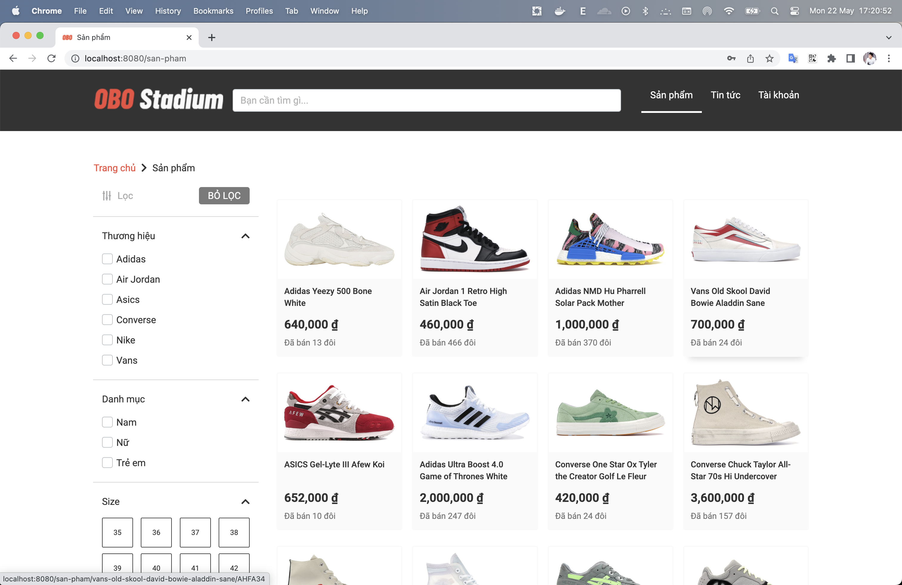

## Giới thiệu và mục tiêu bài lab

Bài lab tổng hợp với thao tác build và deploy một ưng dụng Java Maven lên môi trường Kubernetes

project demo được lấy tại github: [https://github.com/liamhubian/techmaster-obo-web](https://github.com/liamhubian/techmaster-obo-web)

## Chuẩn bị

Để hoàn thành bài lab, người học cần chuẩn bị:

- Cài đặt kubectl trên client
- Cluster Kubernetes đang hoạt động và người học có khả năng kết nối tới cluster này
- Có thể sử dụng các công cụ như minikube, docker-desktop kubernetes, KinD,... trên môi trường lab
- thực hiện cấu hình alias trên terminal bằng command "alias k=kubectl"

## Các bước thực hiện

### Bước 0: tạo cluster với KinD

```bash
$ kind create cluster --name lab --config kind.conf
```

### Bước 1: triển khai cơ sở dữ liệu MySQL trong Docker

```bash
$ docker run -d -p 3306:3306 --name obo-mysql -e MYSQL_ROOT_PASSWORD=123 -e MYSQL_DATABASE=obo mysql:latest
```

Copy `obo.sql` vào `obo-mysql` và thực hiện import data ban đầu:

```bash
$ docker cp obo.sql obo-mysql:/

$ docker exec -it obo-mysql bash

$ mysql -u root -p obo < obo.sql
```

### Bước 2: cài đặt ứng dụng và đóng gói dưới dạng container

Đầu tiên update lại config database trong tệp `application-dev.properties`. Mình đặt các biến thành env cho linh hoạt.

```java
# DATABASE
spring.datasource.url=jdbc:mysql://${DB_HOST}:${DB_PORT}/${DB_NAME}?createDatabaseIfNotExist=true&useJDBCCompliantTimezoneShift=true&useLegacyDatetimeCode=false&serverTimezone=UTC
spring.datasource.username=${DB_USER}
spring.datasource.password=${DB_PASSWORD}
server.port=8080
```

Sử dụng maven để build và đóng gói ứng dụng: 

```bash
$ mvn install

$ docker build -t duylinh158/techmaster-obo-web:1.2 .

$ docker login

$ docker push duylinh158/techmaster-obo-web:1.2
```

Viết docker compose gồm 2 service là `mysql` và `web` obo

```bash
version: '3.9'
services: 
  mysql:
    image: mysql:latest
    ports: 
      - "3306:3306"
    volumes: 
      - ./obo.sql:/docker-entrypoint-initdb.d/init.sql
    environment:
      MYSQL_ROOT_PASSWORD: 123
      MYSQL_DATABASE: obo
  web:
    image: duylinh158/techmaster-obo-web:1.2
    ports: 
      - "8080:8080"
    environment:
      DB_HOST: 192.168.1.8
      DB_PORT: 3306
      DB_NAME: obo
      DB_USER: root
      DB_PASSWORD: 123
    restart: always
```

Chạy docker compose và mở web từ địa chỉ `localhost:8080` xem thành quả:

```bash
$ docker compose up --build -d
```

### Bước 3: triển khai ứng dụng trên môi trường Kubernetes

Tạo configmap template:

```bash
$ k create configmap obo-web-configmap --dry-run=client -o yaml > templates/obo-web-configmap.yaml
```

Thêm các biến env vào tệp configmap template đã tạo trên:

```bash
apiVersion: v1
kind: ConfigMap
metadata:
  creationTimestamp: null
  name: obo-web-config
  namespace: default
data:
  DB_HOST: "192.168.1.8"
  DB_PORT: "3306"
  DB_NAME: "obo"
  DB_USER: "root"
  DB_PASSWORD: "123"
```

Tạo deployment template:

```bash
$ k create deployment obo-web --image duylinh158/techmaster-obo-web:1.2 -o yaml --dry-run=client > templates/obo-web-deployment.yaml
```

Thêm cấu hình `configMap` vào `obo-web-deployment`:

```bash
apiVersion: apps/v1
kind: Deployment
metadata:
  creationTimestamp: null
  labels:
    app: obo-web
  name: obo-web
  namespace: default
spec:
  replicas: 1
  selector:
    matchLabels:
      app: obo-web
  strategy: {}
  template:
    metadata:
      creationTimestamp: null
      labels:
        app: obo-web
    spec:
      containers:
        - image: duylinh158/techmaster-obo-web:1.2
          name: techmaster-obo-web
          envFrom:
          - configMapRef:
              name: obo-web-config
          resources: {}
status: {}
```

Apply template:

```bash
$ k create -f templates/obo-web-configmap.yaml

$ k create -f templates/obo-web-deployment.yaml
```

Kiểm tra các tài nguyên đã được tạo trên cụm hay chưa:

```bash
$ k get all
```

### Bước 4: truy cập tới ứng dụng
```bash
$ k port-forward deploy/obo-web --address 0.0.0.0 8080:8080
```



### Clean up
```bash
k delete -f templates/
```